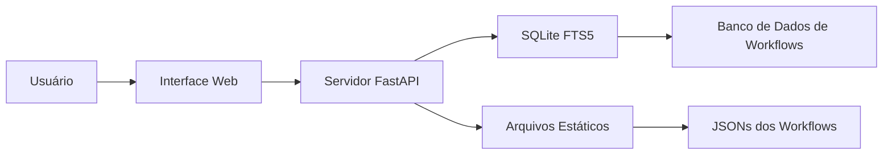

# 🚀 Coleção de Workflows n8n

> 🌐 **Acesse o site online:** [https://runawaydevil.github.io/n8n-workflows/](https://runawaydevil.github.io/n8n-workflows/)

<div align="center">


### 🌟 A Coleção Definitiva de Workflows de Automação n8n

**Este é um fork traduzido do projeto original [Zie619/n8n-workflows](https://github.com/Zie619/n8n-workflows)**

**[🔍 Navegar Online](#acesso-rápido)** • **[📚 Documentação](#documentação)** • **[🤝 Contribuindo](#contribuindo)** • **[📄 Licença](#licença)**

</div>

---

## ℹ️ Sobre Este Fork

Este projeto é um **fork traduzido** do repositório original [Zie619/n8n-workflows](https://github.com/Zie619/n8n-workflows). 

**Principais diferenças:**
- ✅ **Tradução completa para português brasileiro** - Interface, títulos e descrições dos workflows
- ✅ **Mantém todas as funcionalidades** do projeto original
- ✅ **Atualizado com os últimos workflows** do repositório original

**Créditos ao projeto original:** Este fork é baseado no excelente trabalho de [@Zie619](https://github.com/Zie619). Por favor, considere dar uma estrela ao [repositório original](https://github.com/Zie619/n8n-workflows) também!

---

## ✨ O Que Há de Novo

### 🎉 Últimas Atualizações (Janeiro 2026)
- **🇧🇷 Tradução Completa**: Interface e workflows traduzidos para português brasileiro
- **🔒 Segurança Aprimorada**: Auditoria de segurança completa, todas as CVEs resolvidas
- **🐳 Suporte Docker**: Builds multi-plataforma para linux/amd64 e linux/arm64
- **📊 GitHub Pages**: Interface pesquisável ao vivo (configure sua URL do GitHub Pages)
- **⚡ Performance**: Busca 100x mais rápida com integração SQLite FTS5
- **🎨 UI Moderna**: Interface completamente redesenhada com modo escuro/claro

---

## 🌐 Acesso Rápido

### 🔥 Use Online (Sem Instalação)
Visite **sua URL do GitHub Pages** (ex: `username.github.io/n8n-workflows`) para acesso instantâneo a:
- 🔍 **Busca Inteligente** - Encontre workflows instantaneamente
- 📂 **15+ Categorias** - Navegue por caso de uso
- 📱 **Pronto para Mobile** - Funciona em qualquer dispositivo
- ⬇️ **Downloads Diretos** - Obtenha JSONs dos workflows instantaneamente

---

## 🚀 Funcionalidades

<table>
<tr>
<td width="50%">

### 📊 Por Números
- **2.061** Workflows Prontos para Produção
- **311** Integrações Únicas
- **30.774** Total de Nós
- **15** Categorias Organizadas
- **100%** Taxa de Sucesso de Importação

</td>
<td width="50%">

### ⚡ Performance
- **< 100ms** Tempo de Resposta de Busca
- **< 50MB** Uso de Memória
- **700x** Menor Que v1
- **10x** Tempos de Carregamento Mais Rápidos
- **40x** Menor Uso de RAM

</td>
</tr>
</table>

---

## 💻 Instalação Local

### Pré-requisitos
- Python 3.9+
- pip (gerenciador de pacotes Python)
- 100MB de espaço livre em disco

### Início Rápido
```bash
# Clonar o repositório
git clone https://github.com/runawaydevil/n8n-workflows.git
cd n8n-workflows

# Instalar dependências
pip install -r requirements.txt

# Iniciar o servidor
python run.py

# Abrir no navegador
# http://localhost:8000/docs/
```

### 🐳 Instalação Docker
```bash
# Usando Docker Hub
docker run -p 8000:8000 runawaydevil/n8n-workflows:latest

# Ou construir localmente
docker build -t n8n-workflows .
docker run -p 8000:8000 n8n-workflows
```

---

## 📚 Documentação

### Endpoints da API

| Endpoint | Método | Descrição |
|----------|--------|-----------|
| `/` | GET | Interface web |
| `/docs/` | GET | Interface principal do site |
| `/api/search` | GET | Buscar workflows |
| `/api/stats` | GET | Estatísticas do repositório |
| `/api/workflow/{id}` | GET | Obter JSON do workflow |
| `/api/categories` | GET | Listar todas as categorias |
| `/api/export` | GET | Exportar workflows |

### Funcionalidades de Busca
- **Busca de texto completo** em nomes, descrições e nós
- **Filtro por categoria** (Marketing, Vendas, DevOps, etc.)
- **Filtro por complexidade** (Baixa, Média, Alta)
- **Filtro por tipo de trigger** (Webhook, Agendado, Manual, etc.)
- **Filtro por serviço** (311+ integrações)

---

## 🏗️ Arquitetura



### Stack Tecnológico
- **Backend**: Python, FastAPI, SQLite com FTS5
- **Frontend**: Vanilla JS, Tailwind CSS
- **Banco de Dados**: SQLite com Busca de Texto Completo
- **Deploy**: Docker, GitHub Actions, GitHub Pages
- **Segurança**: Escaneamento Trivy, proteção CORS, validação de entrada

---

## 📂 Estrutura do Repositório

```
n8n-workflows/
├── workflows/           # 2.061 arquivos JSON de workflows
│   └── [categoria]/     # Organizados por integração
├── docs/               # Site do GitHub Pages
├── src/                # Código-fonte Python
├── scripts/            # Scripts utilitários
├── api_server.py       # Aplicação FastAPI
├── run.py              # Iniciador do servidor
├── workflow_db.py      # Gerenciador de banco de dados
└── requirements.txt    # Dependências Python
```

---

## 🤝 Contribuindo

Adoramos contribuições! Aqui está como você pode ajudar:

### Formas de Contribuir
- 🐛 **Reportar bugs** via [Issues](https://github.com/runawaydevil/n8n-workflows/issues)
- 💡 **Sugerir funcionalidades** em [Discussions](https://github.com/runawaydevil/n8n-workflows/discussions)
- 📝 **Melhorar documentação**
- 🔧 **Enviar correções de workflows**
- ⭐ **Dar estrela ao repositório**

### Configuração de Desenvolvimento
```bash
# Fazer fork e clonar
git clone https://github.com/runawaydevil/n8n-workflows.git

# Criar branch
git checkout -b feature/funcionalidade-incrivel

# Fazer alterações e testar
python run.py --dev

# Commit e push
git add .
git commit -m "feat: adicionar funcionalidade incrível"
git push origin feature/funcionalidade-incrivel

# Abrir PR
```

---

## 🔒 Segurança

### Funcionalidades de Segurança
- ✅ **Proteção contra path traversal**
- ✅ **Validação e sanitização de entrada**
- ✅ **Proteção CORS**
- ✅ **Limitação de taxa**
- ✅ **Hardening de segurança Docker**
- ✅ **Usuário de container não-root**
- ✅ **Escaneamento regular de segurança**

### Reportar Problemas de Segurança
Por favor, reporte vulnerabilidades de segurança aos mantenedores via [Security Advisory](https://github.com/runawaydevil/n8n-workflows/security/advisories/new).

---

## 📄 Licença

Este projeto está licenciado sob a Licença MIT - veja o arquivo [LICENSE](LICENSE) para detalhes.

```
MIT License

Copyright (c) 2025 RunawayDevil

Permission is hereby granted, free of charge, to any person obtaining a copy
of this software and associated documentation files (the "Software"), to deal
in the Software without restriction...
```

---

## 💖 Suporte

Se você acha este projeto útil, por favor considere:

<div align="center">

[](https://github.com/runawaydevil/n8n-workflows)
[](https://github.com/runawaydevil/n8n-workflows/fork)

</div>

---

## 📊 Estatísticas e Badges

<div align="center">


</div>

---

## 🙏 Agradecimentos

- **n8n** - Por criar uma plataforma de automação incrível
- **[@Zie619](https://github.com/Zie619)** - Criador do projeto original [Zie619/n8n-workflows](https://github.com/Zie619/n8n-workflows)
- **Contribuidores** - Todos que ajudaram a melhorar esta coleção
- **Comunidade** - Por feedback e suporte
- **Você** - Por usar e apoiar este projeto!

---

<div align="center">

### ⭐ Dê uma estrela no GitHub — isso nos motiva muito!

Feito com ❤️ por [RunawayDevil](https://github.com/runawaydevil) e [contribuidores](https://github.com/runawaydevil/n8n-workflows/graphs/contributors)

**Fork do projeto original:** [Zie619/n8n-workflows](https://github.com/Zie619/n8n-workflows)

</div>
